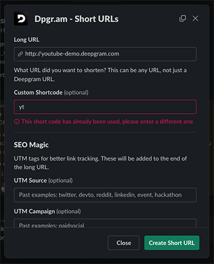

# Dpgr.am

[](CODE_OF_CONDUCT.md)

The Deepgram URL shortener. Built using [Bolt-js](https://github.com/slackapi/bolt-js) from Slack, this bot takes care of channel-based URL shortening, and the redirect of HTTP requests.



## Getting started

```bash
npm install
```

### Run in

```
npm run dev
```

### Build it

```
npm run build
```

### Run it

```
npm start
```
